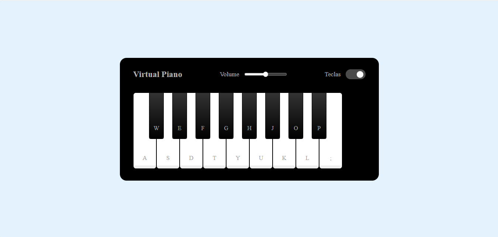

# 🎹 Piano Virtual

Um **piano virtual interativo** desenvolvido com ,  e .   

Toque notas reais com seu teclado ou clique com o mouse nas teclas. Um projeto musical e educativo, ideal para quem está aprendendo programação front-end e quer explorar interações com áudio no navegador.  

---

## 🎬 Demonstração

## 🚀 Tecnologias Utilizadas

---

## 🕹️ Funcionalidades

- 🎵 Toque notas com o teclado do computador
- 🖱️ Toque clicando nas teclas com o mouse
- 🖱️ Toque clicando nas teclas ultilizando as letras do teclado
- 🔊 Áudio real das notas musicais
- 🎹 Design inspirado em teclados reais
- 💡 Interface simples e responsiva

---

